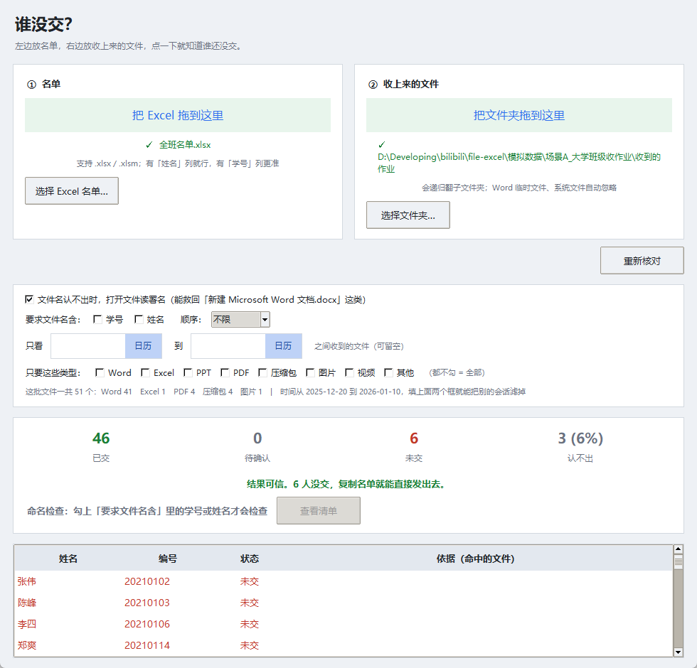

# 谁没交？—— 文件夹名单核对器

左边放 Excel 名单，右边放收上来的文件夹，点一下就知道谁没交。



**直接下载用**（不用装 Python）：
[Releases](https://github.com/dongdong-web/who-didnt-submit/releases/latest) →
下 `who-didnt-submit-v0.1.0.zip`，解压后双击里面的 `谁没交.exe`。

> 第一次打开可能提示「可能有害」——**这是 Windows 对下载来的 exe 的常规提示，
> 不是病毒**。点「确定」放行即可，程序会自己清掉这个标记，以后不再弹。
> 详见下面[「下载后提示可能有害」](#下载后提示可能有害怎么办)。

> 这份是**给用的人**看的。架构、测试体系、踩过的坑、可拓展方向
> 看 [项目说明.md](项目说明.md)。

---

## 给老师 / 班长 / HR 用

1. **左边**：把 Excel 名单拖进去。表里有一列叫「姓名」就能用，再有列「学号 / 工号」会更准。
2. **右边**：把收上来的文件夹拖进去。子文件夹会一起翻。
3. **两样都拖进去就自动开始核对** —— 不用点按钮。
4. 看「未交」几个人 → 点 **复制未交名单** → 直接粘到群里。

**改任何条件都会自动重新核对**（改完等半秒左右）。所以调整筛选、
勾选命名要求时不用反复点按钮。右上角那个「重新核对」只在你想手动重跑时用。

「判定依据」那一栏会写清楚每个人是靠哪个文件认出来的，点一行能看详情。
老师要拿着名单去催人，得能自己核对，所以每个结论都能追溯到具体文件名。

「开始核对」下面有三组选项：

| 选项 | 什么时候用 |
|---|---|
| **打开文件读署名** | 默认开。文件名认不出时，进去找「姓名：张伟」 |
| **要求文件名含学号 / 姓名** | 勾上就要检查命名规范，不合规的单独列出来 |
| **只看 [起] 到 [止]** | 从微信目录整个往下拖时用，把别的会话滤掉 |
| **只要这些类型** | 一个都不勾 = 全部。勾一个就是「只看这个」 |

**类型名用的是老师嘴里的说法**：Word / Excel / PPT / PDF / 压缩包 / 图片 / 视频，
不是「文档 / 演示 / 表格」这种按格式划分的行话 —— 后者得先在脑子里翻译一遍。

**一个都不勾就是不限制**，所以默认状态是干净的，也不替你做事：
想只看 Word 就勾 Word，想收活动照片就勾图片。

> ⚠ **勾了类型会改变「未交」人数。** 你只勾 Word，那些交 PDF / 压缩包的人就全变成「未交」了。
> 所以只要筛选生效，结论那一行会额外提醒你一句：
> 「未交名单里可能有人只是文件被滤掉了」。**想确认就把勾去掉再看一次。**

拖进文件夹后会自动告诉你里面都是些什么：

> 这批文件一共 51 个：Word 41　Excel 1　PDF 4　压缩包 4　图片 1

瞟一眼就知道该勾哪个 —— 比如看到「图片 47」就知道那些多半是表情包。

拖不进去的话，每张卡片下面都有「选择…」按钮，效果一样。

---

## 下载后提示「可能有害」怎么办

**这不是病毒，是 Windows 对所有「从网上下载的 exe」的常规提示。**

只要你通过浏览器 / 微信 / 网盘下载过这个压缩包，Windows 就会给里面的文件
打上「来自 Internet」的标记，第一次运行时必然弹这个警告：

> 打开这些文件可能会对你的计算机有害

**怎么办：点「确定」放行就行。** 程序启动后会自己把这个标记清掉，
**以后不会再弹**。

不放心的话也可以自己清：右键 `谁没交.exe` → 属性 → 最下面勾选「解除锁定」→ 确定。
或者用 PowerShell：

```powershell
Unblock-File .\谁没交.exe
```

**想完全避开这个提示**：用 7-Zip / Bandizip 解压 —— Windows 自带的解压器
会把标记传播到每个文件，第三方解压器默认不传播。

---

## 微信收来的文件怎么归集

**不用一个个另存为。** 微信电脑版收到的文件是自动落盘的。

**但路径不要照抄网上的** —— 微信的存储位置是**可以改的**，
在「设置 → 文件管理」里能看到你自己机器上的实际路径，比如：

```
D:\mybin\xwechat_files          ← 微信 4.x，你把它改到 D 盘了
C:\Users\<你>\Documents\WeChat Files   ← 微信 3.x 的默认位置
```

**你直接把那个根目录拖进来就行**，工具会自动往下钻到真正放文件的那一层：

```
xwechat_files\<账号>\msg\file\<年月>\          ← 4.x
WeChat Files\<账号>\FileStorage\File\<年月>\   ← 3.x
```

这一步是必须的：微信根目录里还塞着图片、视频、消息数据库，
动辄几万个文件，直接扫又慢又没意义 —— 我们只关心别人发来的文档。

但这个目录还有个坑：**它混着你所有会话的文件**，只按月份分。
1 月的目录里既有这次收的作业，也有同事发的表格、家人发的照片。

- **这个月只收了这一次作业** → 直接扫
- **混着别的东西** → 拖进来之后工具会先告诉你这批文件的**时间跨度**，
  你把收作业那几天填进「只看 [起] 到 [止]」就行

日期框右边的 **「日历」** 按钮会弹日历，不用手输。手输也认
`2026-01-03`、`20260103`、`2026-01` 这几种写法。

（日期选择器是自己用 tkinter 画的 —— `tkcalendar` 会连带拖进 babel 一堆依赖，
为这点功能不值当。）

顺带一提，微信还有个行为：同一个文件被不同的人各发一次，本地就存几份、
文件名后面带序号。所以 `张三(1).docx`、`张三(2).docx` 这种很常见，
工具会把它们都算成张三交的。

**手机微信是另一回事**：手机上的文件只能一个个转发到文件传输助手再另存，
归集成本比人工对名单还高。**所以这个工具适合用 PC 微信 / 邮箱 / 问卷收材料的人。**

---

## 命名规范检查

老师常常会要求「文件名必须写成 `学号-姓名`」。勾上「要求文件名含学号 / 姓名」，
再选一下「顺序」，工具就把不合规的文件单独列出来，能直接复制成一份通知发群里：

```
20260103王五.zip      缺学号    王五（20210108）
万里.docx             缺学号    万里（20210147）
何伟作业.docx          缺学号    何伟（20210127）
```

### 为什么不做「自动生成正则」

你可能会想：让工具生成一个正则来校验，不是更通用吗？**恰恰相反，正则在这里更容易做错。**

工具本来就能认出文件名里的学号和姓名（这是它的核心能力）。所以
「符合 `学号-姓名` 格式」可以拆成三个它直接就能回答的问题：

1. 有没有学号？
2. 有没有姓名？
3. 学号在姓名前面吗？

**这比正则宽容，也更贴近老师的真实意图。** 举个反例：

- 学生写的是 `20210101_张伟_实验一.docx`
- 老师的正则 `^\d{8}-[\u4e00-\u9fa5]+$` 判定**不合规**
- 但老师的真实意图其实是「要有学号和姓名」—— 用元素检查就通过了

写正则的人得把分隔符、扩展名、空格、大小写全都想到，漏一个就误判一片。
而「有没有学号 / 姓名、谁在前」是意图层面的，怎么分隔都不影响。

### 定规范之前，先看看大家实际怎么命名的

勾上命名检查后，结果那一行会顺带告诉你现状：

> 命名规范：✕ 49 个不符合　（这 51 个文件里，含学号 2、含姓名 48）

**这后半句才是最有用的** —— 它直接告诉你「要求写学号会牵连 49 个人」。
规范是你定的，但定之前得知道代价。

**还有个特别容易混的地方：「不合规」和「认不出」是两件事。**

- **认不出** = 工具找不到这个人（严重，会漏收作业）
- **不合规** = 不符合你的命名要求，但**工具照样可能匹配得上**

没勾任何要求时，「查看清单」是灰的，旁边会写明白为什么
（`命名检查：勾上「要求文件名含」里的学号或姓名才会检查`）。

拿场景A举例：51 个文件里只有 **2 个**同时写了学号和姓名，剩下 **49 个**都「不合规」。
但这个班本来就是按姓名命名的，工具用得好好的。

**所以「合规」是你定的，不是工具猜的** —— 规则必须你自己勾。

还有个更值钱的用法：**发通知之前**先用它生成一份合规命名的清单发给学生，
收的时候一次就对。比收完了再筛出来让人重交强得多。

---

## 它是怎么判断的

只有五条规则，没有任何 AI：

| 规则 | 解决什么 |
|---|---|
| **学号 / 工号优先** | 学号唯一，姓名会重名。文件名里有学号就直接定人 |
| **最长优先 + 遮蔽** | 名单里同时有「陈峰」「陈峰华」时，`陈峰华_实验报告.docx` 只算陈峰华 |
| **噪声过滤** | `~$韩梅.docx` 是 Word 临时锁文件，`.DS_Store`、`Thumbs.db` 是系统文件，都不算交作业 |
| **读文件内容找署名** | 文件名认不出时，打开 Word / Excel / PPT 找「姓名：张伟」这种署名 |
| **拼音匹配** | `chenfeng.docx`、`zengyi.docx` 这种拼音文件名也能认 |

第四条值得单独说，因为它最容易做歪：

- **只在需要时才读**。文件名能认出来就不读内容，省时间。
- **只在署名位置找名字**，不在全文里瞎找。否则正文里一句
  「参考了李四同学的代码」就会把李四算成交了。
- 正文里提到名字（没有「姓名：」这种标签）只能算**待确认**，不算交。
- 它顺手解决了重名：`张伟.docx` 光看文件名分不清是哪个张伟，
  但打开一看内容写着「编号：20210101」，就定死了。
- 能读 `.docx` / `.xlsx` / `.pptx` / `.zip` / `.txt`。
  读 office 文件**没走 python-docx / python-pptx**，而是直接解 zip
  抽 XML 里的 `<w:t>` 文本 —— 省掉 lxml 和 Pillow 几十兆依赖，
  打包体积不用为了这个功能再涨一截。

第五条（拼音）也有个坑：**多音字**。

「曾毅」的「曾」作姓读 zēng，但拼音库默认给 céng。只取默认读音，
`zengyi.docx` 就永远认不出来 —— 所以要把多音字的**所有读法**都算上。

另一个坑是**单字名**：`李` → `li` 只有 2 个字母，会撞上 `list`、`line`
一大把英文单词，所以最短只收 4 个字母的拼音。

不想让它读文件，把「开始核对」下面那个勾去掉就行。

输出是**三态**，不是两态：

```
✓ 已交     有把握的
? 待确认   匹配上了但不敢确定（比如两个张伟）
✕ 未交     什么都没匹配上
```

**为什么要「待确认」**：这个工具唯一不能犯的错，是把没交的人说成交了。
它输出的是一份可以收工的确认单，说错就是在漏收作业，而且不会有人发现。
所以拿不准的时候它宁可说拿不准。

---

## 什么时候别信它

看统计条上那个 **「认不出」的百分比**：

| 认不出占比 | 说明 |
|---|---|
| **< 10%** | 好用，结果可以直接用 |
| **10% ~ 30%** | 能用，「未交」名单建议人工扫一眼再发 |
| **> 30%** | **别用**。这时候工具给的名单是错的，比人工还慢 |

超过 30% 时界面会直接弹红字警告你。

这东西的适用性完全取决于**文件是怎么收上来的**：

- 用**问卷 / 接龙管家**收的 → 平台会自动重命名成 `1_张三_20260103.docx` → 最好用
- 用**微信群 / 邮箱**收的 → 会出现 `新建 Microsoft Word 文档.docx` → 大概率不能用

`模拟数据/场景C_微信群收报名材料/` 就是专门演示这种情况的：
25 人里真实只有 3 人没交。

- **关掉「读文件内容」**：工具报「11 人没交」，**冤枉 8 个人**
- **打开（默认）**：报「3 人没交」，正好是那对的 3 个人。
  被救回来的 8 个人，文件名叫「新建 Microsoft Word 文档.docx」，
  正文第一行却写着「姓名：张伟」

读内容把认不出率从 55% 压到了 29%。剩下 9 个是真没辙：图片、PDF 扫描件、空文档。

还有一个场景值得看：`模拟数据/场景D_拼音命名/`，**整个班的文件名都是拼音**。

- **有拼音匹配**：17 人交了，全认出来
- **没有拼音匹配**：**一个人都认不出来**（0 已交 / 17 个认不出）

一个班里只要有三分之一的人用拼音命名，不做拼音匹配就等于白干。

动手前先拿一批真实文件试一下，看认不出占多少，再决定要不要用。

---

## 开发者部分

### 文件

| 文件 | 作用 |
|---|---|
| `app.py` | 界面（tkinter）+ 导出 + 无头自测 |
| `matcher.py` | 匹配核心，只有 220 行，不依赖界面 |
| `make_sample_data.py` | 生成三个场景的模拟数据 |
| `verify_sample_data.py` | 用核心跑模拟数据，对照预期 |
| `benchmark.py` | 对照实验：「随手写」vs「加了三道保险」 |
| `make_icon.py` | 生成 icon.ico |
| `模拟数据/` | 3 个场景、111 个模拟文件，见里面的 README |
| `dist/谁没交/` | 打包好的成品，双击里面的 `谁没交.exe` |

### 跑起来

需要一个带 tkinter 的 Python 3.10+，再装两个库：

```powershell
python -m pip install tkinterdnd2 pypinyin openpyxl

python app.py                 # 打开界面
python app.py --selftest      # 无头自测（也写一份到 %TEMP%\谁没交_selftest.txt）
python make_sample_data.py    # 重新生成模拟数据（先把模拟数据/ 建出来）
python verify_sample_data.py  # 四个场景对照预期
python benchmark.py           # 对照实验：随手写 vs 加了三道保险
```

自测依赖 `模拟数据/`。它是 `.gitignore` 掉的（138 个生成文件），
clone 下来先跑一次 `make_sample_data.py` 就有了。

`--selftest` 会顺带测导出功能，并把结果写成文件 —— 这样打包成 `--noconsole`
的 exe 之后依然能验证（exe 没有 stdout）。

### 重新打包

```powershell
python make_icon.py
python -m PyInstaller --onedir --noconsole --icon icon.ico --name "谁没交" `
    --clean --noconfirm --distpath dist --workpath build `
    --collect-all tkinterdnd2 `
    --exclude-module numpy --exclude-module pandas --exclude-module lxml `
    --exclude-module PIL --exclude-module PIL.Image `
    --exclude-module docx --exclude-module pptx `
    --hidden-import content --hidden-import pypinyin app.py
```

产出是 `dist/谁没交/` 整个目录（约 37MB），双击里面的 `谁没交.exe`。
分发时把这个目录压成 zip 就行（约 14MB）。

**为什么用 `--onedir` 而不是 `--onefile`：**

`--onefile` 每次启动都要把自己解压到系统临时目录（`%TEMP%\_MEIxxxx`），
解压不出来就直接死，而且 `--noconsole` 下**连报错都看不见**——窗口一闪就没了。
本机就踩到了：

```
[PYI-29756:ERROR] Could not create temporary directory!
```

`--onedir` 不需要运行时解压，启动更快，也不赌系统临时目录好不好使。
代价是体积从 12MB 变成 31MB、以及多一层目录。

那几个 `--exclude-module` 都是必须的，而且埋着一个坑：

- `numpy` / `pandas` / `lxml` / `PIL`：openpyxl 会顺手把它们拖进来，
  不排除体积接近翻三倍。这几个都是 openpyxl 的**可选**依赖，纯读写单元格用不到。
- `docx` / `pptx`：python-docx 和 python-pptx。**读文件内容根本没走这两个库**
  （见 `content.py`，直接解 zip 抽 XML），所以也不该打进包里。
- **`lxml` 和 `docx` 必须一起排，不能只排一个。** python-docx 对 lxml 是**硬依赖**；
  排了 lxml 却留着 docx，它 import 就失败 —— 而失败会被 `extract_text` 的
  `try/except` 吞掉，表现成「读文件内容这个功能悄无声息地不工作」，
  界面上一切正常，只是结果默默变回旧版本。**这个坑踩过一次，是靠 `--selftest` 抓出来的。**
- `--hidden-import content` 是保险：`content` 是函数里动态 import 的，
  万一 PyInstaller 没分析到，打包版会以同样的方式静默失去这个功能。
- `--collect-all tkinterdnd2` 不能省：拖放靠它的 Tcl 扩展（tkdnd），
  那是个二进制库 + 一堆 script 文件，PyInstaller 默认不会全带上。

### 拖放为什么用 tkinterdnd2 而不是 ctypes

一开始是拿 ctypes 子类化窗口过程接 `WM_DROPFILES`，**看着能用，其实必崩**：

- `SendMessage` 路径（自己调）没问题，测着一切正常
- 但**真实拖放是 `PostMessage` 投递的**，消息在 Tk 的 mainloop 里被处理，
  此时 Python 已经放开了 GIL；ctypes 回调再进来会让线程状态错乱
- 结果：`Fatal Python error: PyEval_RestoreThread ... GIL is released`，
  进程直接没（`0xC000041D`）

最小复现（Tk + 子类化 + `PostMessage`）稳定崩溃，**跟程序逻辑一点关系都没有**。
更坑的是 `root.update()` / `update_idletasks()` 也会触发同一条路径 ——
所以连"我调一下 update 刷新界面"都可能把程序带走。

tkinterdnd2 的拖放由 Tcl 在 C 层处理，**不经过任何 Python 回调**，也就没有这回事。

打包后验证：

```powershell
& 'dist\谁没交\谁没交.exe' --selftest
Start-Sleep -Seconds 15        # --noconsole 的 exe 不阻塞调用方
Get-Content "$env:TEMP\谁没交_selftest.txt"
```

注意两点：

- `--noconsole` 的 exe 不会把 stdout 交给调用它的控制台，所以自测结果写进一个报告文件。
  报告会依次试 `%TEMP%` 和当前目录，看它打印出来的最后一行路径。
- exe 必须和 `模拟数据/` 在同一层，自测才找得到数据。

如果 exe 双击后一闪而过，先看 `%TEMP%\谁没交_crash.txt` —— 程序里加了兜底，
任何未捕获异常都会写到那里。

---

## 已知边界

这些情况它认不出来，属于已知的做不到：

- **纯英文名**：`Tom.docx`、`Alice-作业.pdf`——名单是中文，拼音也对不上
  （拼音只解决中文名的罗马化，不解决外文名）
- **图片和扫描件**：`.jpg`、`.png`、`.pdf`——里面就算有字也读不出来（要 OCR，太重）
- **空文档**：交了，但里面什么都没写
- **整个班打成一个包**：`全班作业汇总.zip` 里装着所有人的作业——
  这种「一个包装全班」是内容匹配的天然盲区
- **简称**：`小陈的作业.docx`
- **名单外的补交**：会落在「认不出」里
- **学号和日期撞车**：`20210101` 既可能是学号也可能是日期（概率很低）

当前版本还有一个刻意没做的选择：**zip 不进去看**。`冯磊.zip`、`曹阳.zip`
这类会被当成「已交」处理（文件名里有姓名），但 `全班作业汇总.zip` 落在「认不出」里。
